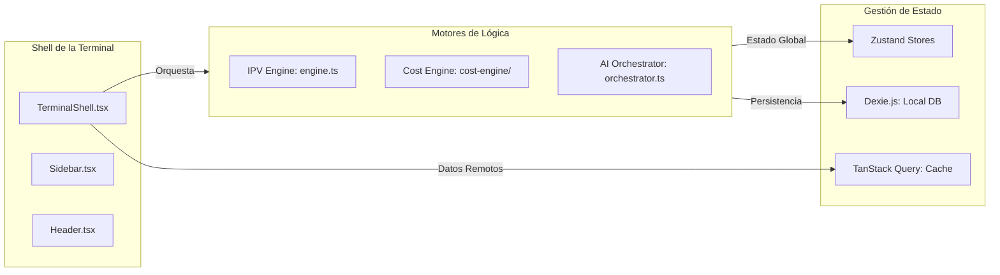

# C4 Component Diagram (Frontend Core)

```mermaid
graph LR
    subgraph UI_Shell [Shell de la Terminal]
        TerminalShell[TerminalShell.tsx]
        Sidebar[Sidebar.tsx]
        Header[Header.tsx]
    end

    subgraph Engines [Motores de Lógica]
        IPVEngine[IPV Engine: engine.ts]
        CostEngine[Cost Engine: cost-engine/]
        AIOrch[AI Orchestrator: orchestrator.ts]
    end

    subgraph State_Management [Gestión de Estado]
        Zustand[Zustand Stores]
        Dexie[Dexie.js: Local DB]
        ReactQuery[TanStack Query: Cache]
    end

    TerminalShell -- "Orquesta" --> Engines
    Engines -- "Persistencia" --> Dexie
    Engines -- "Estado Global" --> Zustand
    TerminalShell -- "Datos Remotos" --> ReactQuery
```
