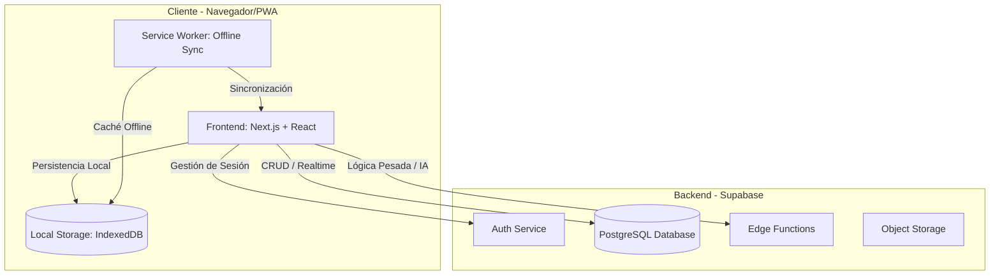

# C4 Container Diagram

```mermaid
graph TB
    subgraph Client [Cliente - Navegador/PWA]
        Frontend[Frontend: Next.js + React]
        IDB[(Local Storage: IndexedDB)]
        SW[Service Worker: Offline Sync]
    end

    subgraph Backend [Backend - Supabase]
        Auth[Auth Service]
        Database[(PostgreSQL Database)]
        Functions[Edge Functions]
        Storage[Object Storage]
    end

    Frontend -- "CRUD / Realtime" --> Database
    Frontend -- "Persistencia Local" --> IDB
    Frontend -- "Gestión de Sesión" --> Auth
    Frontend -- "Lógica Pesada / IA" --> Functions
    SW -- "Sincronización" --> Frontend
    SW -- "Caché Offline" --> IDB
```
