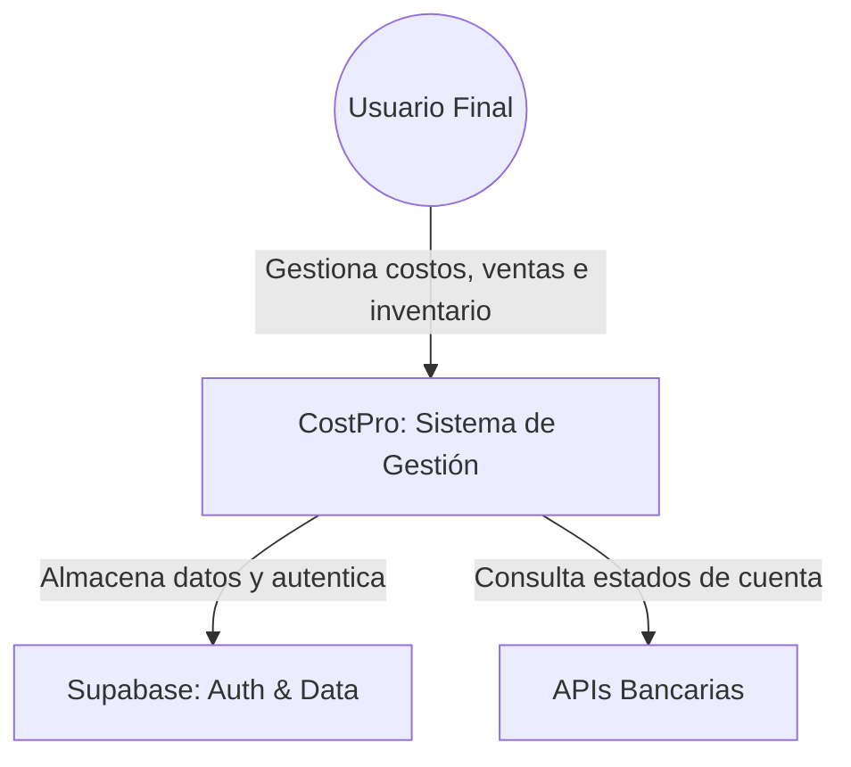

# C4 System Context Diagram

```mermaid
graph TD
    User((Usuario Final))
    System[CostPro: Sistema de Gestión]
    Supabase[Supabase: Auth & Data]
    BankAPIs[APIs Bancarias]

    User -- "Gestiona costos, ventas e inventario" --> System
    System -- "Almacena datos y autentica" --> Supabase
    System -- "Consulta estados de cuenta" --> BankAPIs
```
